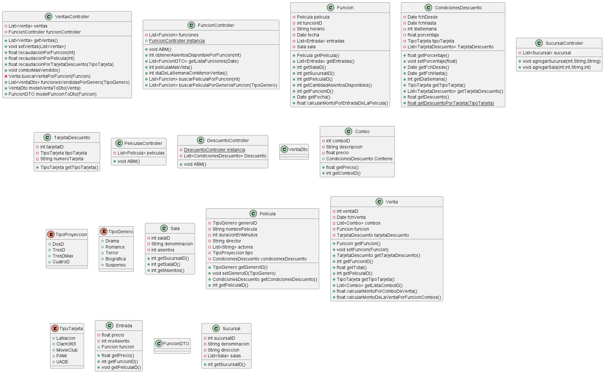

# POO-TPO-IV
Repositorio para el trabajo práctico 4 de la materia Paradigma Orientado a Objetos

<strong> Enunciado </strong>

# 467154 - 2024-1C - NOCHE - MARTES

## PARADIGMA ORIENTADO A OBJETOS

### Trabajo Práctico

---

**Materia:** Introducción a la Orientación a Objetos

---

## Ejercicio

### Enunciado Gestión del CINE “BlockBuster”

Un complejo de salas de cines lo ha contratado para desarrollar un sistema de venta online de entradas y combos.

El sistema debe permitir al cliente seleccionar la sucursal a la que desea asistir. Posteriormente, se le presentarán las películas disponibles, que podrán filtrarse por género, tipo (2D, 3D, 3D MAX, 4D, 5D), duración, director y actores.

Una vez que el cliente seleccione una película, se le mostrarán todas las funciones disponibles para esa película, junto con el horario y la cantidad de asientos disponibles en cada sala. Si el cliente confirma la compra del asiento, se le presentarán las opciones de distintos combos que puede adquirir.

De lunes a miércoles, las entradas se venden al 50% de su precio normal. Al momento de pagar, los clientes pueden presentar tarjetas de descuento (La Nación, Clarín 365, MovieClub, PAMI, UADE), las cuales implican descuentos adicionales sobre el precio de las entradas, combos o ambos. Cada tarjeta de descuento tiene distintos porcentajes de descuento según el combo y el tipo de película.

Usted es parte del equipo de desarrollo y ha recibido un modelo realizado por el arquitecto y el líder funcional. Se le solicita que implemente todas las clases del modelo, teniendo en cuenta que debe armar un proyecto que cumpla con los siguientes requisitos:

---

## Resolver

### Diseño:

- Reestructurar el diagrama de clases basándose en el entregado en el documento, estableciendo relaciones, cardinalidad y multiplicidad.
- Crear el diagrama de secuencia `recaudacionPorPelicula` de la clase `VentasController`.

### Construcción:

- Implementar el patrón **MVC** en el código propuesto y aplicar el patrón **Singleton** a cada uno de los controladores.
- Crear un menú en **Swing** que permita controlar los siguientes casos de uso:
    - Registrar una nueva función por género.
    - Registrar una película por género.
    - Consultar las películas por género.
    - Emitir un reporte de las películas con mayor recaudación.
- Generar por cada caso de uso los **tests unitarios** que permiten cubrir la funcionalidad y código.

---

## OBSERVACIONES:

El enunciado y diagrama de clases adjunto detalla a modo general los requerimientos necesarios para desarrollar el ejercicio. En caso de ser necesario, se pueden incorporar clases, atributos y métodos que considere necesarios para cumplir con las funcionalidades solicitadas.

## Integrantes
- Diaz, Iván Alejandro.
- Galarza Cavedo, Santino.
- Maceira, Santiago.
- Martorella, Franco Matías.
- David, Georges Ammiel.